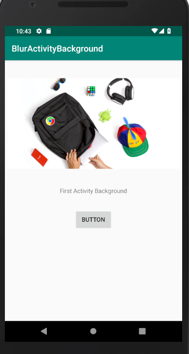
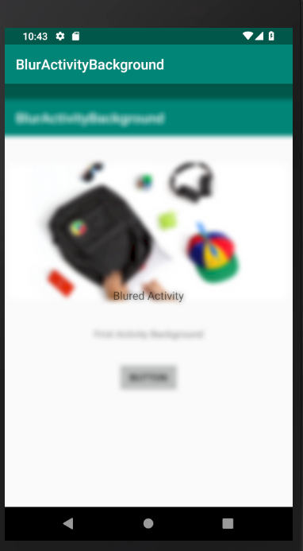

# BlurActivityBackground
When call second Activity we wanna show a blurred background from the previous page(Activity).

blurred background Activity. 
-Using Kotlin , Androidx 
-Min support SDK 15( Android 4.03 )
-No permission needed for screenshot (I wont save screenshot)

Scrrenshots:

     
         

if you just need to blur the background image of current Activity , delete  other codes &  just  use this :

//3- blur background of layout:
      ViewFilter.getInstance(this)
            .setRenderer(  BlurRenderer(20)) 
            .applyFilterOnView(  root_constraintLayout_mpg, //view
                root_constraintLayout_mpg    ) //backgroundView (root view)
