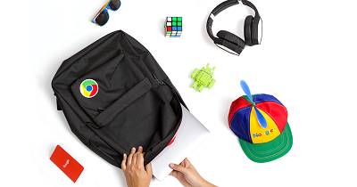

# BlurActivityBackground
When call second Activity we wanna show a blurred background from the previous page(Activity).

blurred background Activity. using Kotlin , Androidx.
Scrrenshots:

      
     
    

    
    

